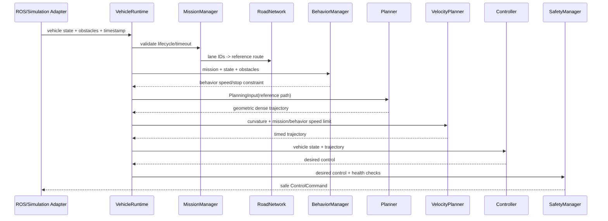

# Architecture

## Deployment boundary

```text
Cloud / Gateway
      │ ExecuteMission Action, status/events
====== ROS/network boundary ================================
      │
RosAdapter (namespace, QoS, timestamp, message conversion)
      │ domain objects
VehicleRuntime
├── MissionManager       task validation and lifecycle
├── RoadNetwork          lane geometry and mission route materialization
├── BehaviorManager      scenario policy / external BT XML
├── Planner              geometric dense path
├── VelocityPlanner      curvature and longitudinal limits
├── Controller           trajectory tracking
└── SafetyManager        final command authority
      │ ControlCommand
VehicleInterface
├── SimulatedVehicle     teaching and regression
└── CAN/DBW Adapter      deployment-specific
```

Dependencies point inward. `domain`, `runtime`, `mission`, `planning`, `control`,
`safety`, `vehicle` and `simulation` contain no ROS headers. ROS messages and RViz
types stay at the adapter boundary.

## Runtime cycle



## State ownership

| State | Owner | Notes |
|---|---|---|
| Mission lifecycle | MissionManager | Never inferred by cloud from velocity |
| Runtime state | VehicleRuntime | Derived from mission and safety action |
| Active faults | FaultManager | Deduplicated and cleared when condition recovers |
| Desired control | Controller | Cannot bypass SafetyManager |
| Reported vehicle state | VehicleInterface | Timestamp and health required |
| ROS connectivity | ROS Adapter | Must not change autonomy decisions directly |

## Extension rules

1. A new scenario supplies a RoadNetwork, lane-ID Mission, constraints and Behavior XML; it does not fork Runtime.
2. A new planner implements `planning::Planner` and returns the common trajectory.
3. A new controller implements `control::Controller` and consumes that trajectory.
4. A real chassis implements `vehicle::VehicleInterface`; hardware ESTOP remains independent.
5. Cloud commands become Missions. Planner/controller switches are debug configuration only.
